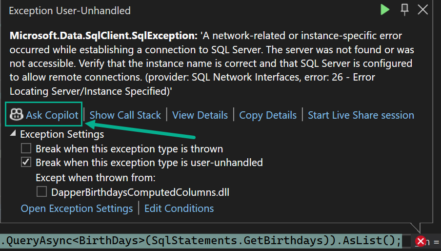

# Debugging

When GitHub Copilot is active and a runtime exception is raised a developer can click, Ask Copilot to get suggestions which is what the project is for. Once asking coilot a window opens with recommendations and in most cases why the exception was thrown.

The connection string is deliberately setup to point to a non-existing SQL-Server instance and the default time out has been altered from the original which is 30 seconds down to two seconds.




> **Note**
> This project was created to show a simple example for SQL-Server computed columns and was put here to show the above.

# About (When the project has no issues)

Provides an interesting way to compute how old a person is in years.

Original code came from this Stackoverflow [post](https://stackoverflow.com/a/11942/5509738).

I took the code and created a simple Console project to demonstrate how to use it with a computed column in a SQL-Server database table using Dapper to read the data.

```sql
CREATE TABLE [dbo].[BirthDays](
	[Id] [int] IDENTITY(1,1) NOT NULL,
	[FirstName] [nvarchar](max) NULL,
	[LastName] [nvarchar](max) NULL,
	[BirthDate] [date] NULL,
	[YearsOld]  AS ((CONVERT([int],format(getdate(),'yyyyMMdd'))-CONVERT([int],format([BirthDate],'yyyyMMdd')))/(10000))
```

- Take birthdate and current date, format and convert to integer
- Subtract birthdate from current date
- Divide by 10,000 to get years old

## EF Core version

See project `EF_CoreBirthdaysComputedColumns`