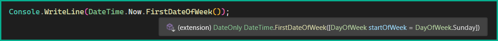
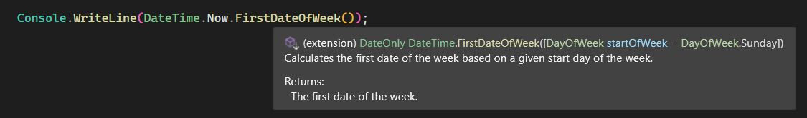

# Documenting code

Developers here tend not to document code which in some cases means that other developers may not understand the purpose of a class or method.

## Example

Here is a method which is easy to understand.

```csharp
public static class DateTimeExtensions
{
    public static DateOnly FirstDateOfWeek(this DateTime sender, DayOfWeek startOfWeek = DayOfWeek.Sunday)
        => DateOnly.FromDateTime(sender.AddDays(-1 * (7 + (sender.DayOfWeek - startOfWeek)) % 7));
}
```

When using the above method this is what is shown with Intellisense.



Using /doc feature of GitHub Copilot

```csharp
public static class DateTimeExtensions
{

    /// <summary>
    /// Calculates the first date of the week based on a given start day of the week.
    /// </summary>
    /// <param name="sender">The DateTime object representing the current date.</param>
    /// <param name="startOfWeek">The start day of the week (default is Sunday).</param>
    /// <returns>The first date of the week.</returns>
    public static DateOnly FirstDateOfWeek(this DateTime sender, DayOfWeek startOfWeek = DayOfWeek.Sunday)
        => DateOnly.FromDateTime(sender.AddDays(-1 * (7 + (sender.DayOfWeek - startOfWeek)) % 7));
}
```

Much better with proper documentation from Copilot.



