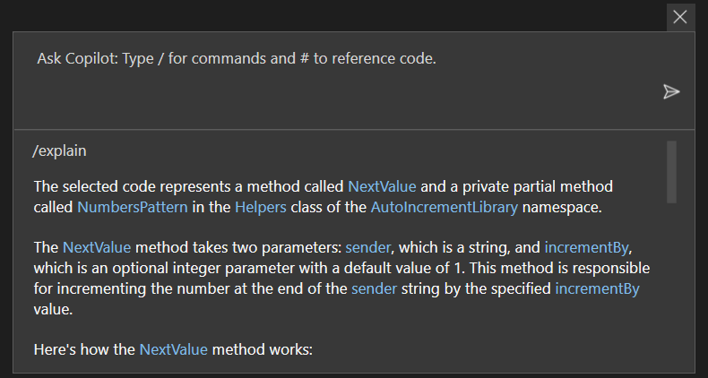
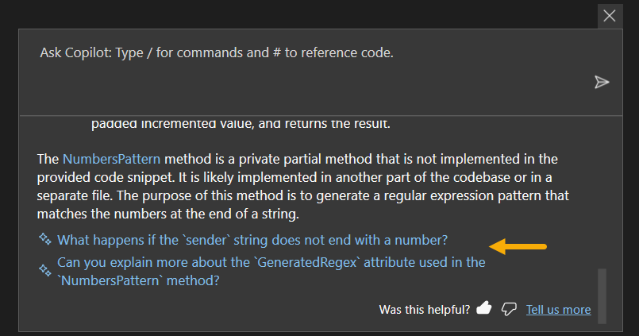
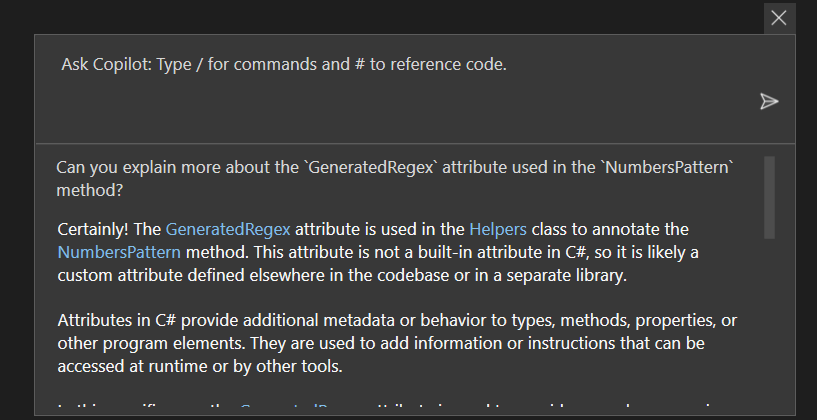
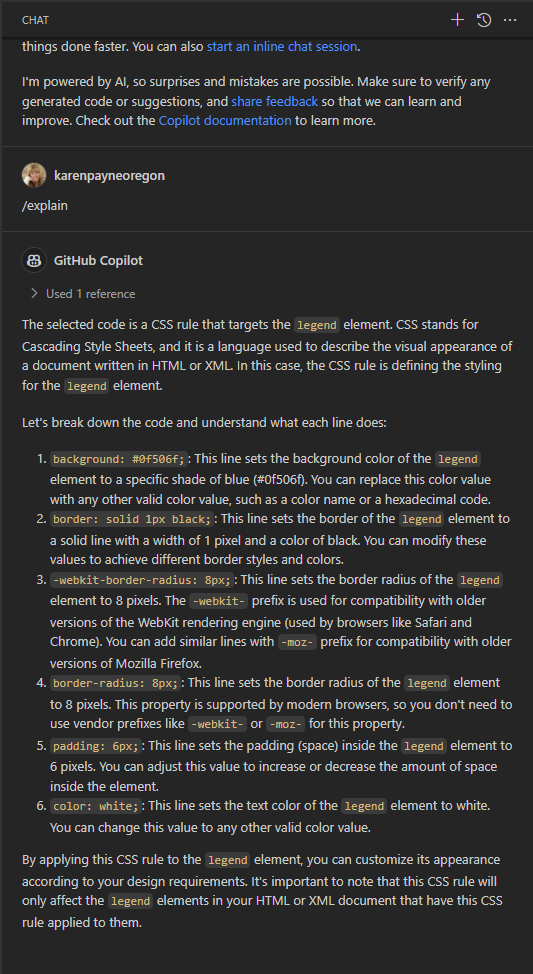

## Using Copilot to explain code

When examining complex code as shown below Copilot provides a feature to explain the code.

## C# example (JavaScript example below)

```csharp
public static string NextValue(string sender, int incrementBy = 1)
{
    string value = NumbersPattern().Match(sender).Value;
    return sender[..^value.Length] + (long.Parse(value) + incrementBy)
        .ToString().PadLeft(value.Length, '0');
}

[GeneratedRegex("[0-9]+$")]
private static partial Regex NumbersPattern();
```

Here is the result for using `/explain` feature. The blue text are hyperlinks




The selected code represents a method called NextValue and a private partial method called NumbersPattern in the Helpers class of the AutoIncrementLibrary namespace.
The NextValue method takes two parameters: sender, which is a string, and incrementBy, which is an optional integer parameter with a default value of 1. This method is responsible for incrementing the number at the end of the sender string by the specified incrementBy value.
Here's how the NextValue method works:
1.	It first calls the NumbersPattern method, which returns a regular expression pattern that matches the numbers at the end of a string.
2.	It then uses the Match method of the Regex class to find the match of the NumbersPattern in the sender string. The Match method returns a Match object that represents the first occurrence of the pattern in the string.
3.	It retrieves the matched value using the Value property of the Match object. This value represents the numbers at the end of the sender string.
4.	It removes the numbers from the sender string by using the range operator [..^value.Length]. This operator creates a substring of the sender string from the beginning to the length of the matched value, excluding the matched value itself.
5.	It converts the matched value to a long using long.Parse and adds the incrementBy value to it.
6.	It converts the incremented value back to a string using ToString() and pads it with leading zeros using the PadLeft method. The length of the padded string is determined by the length of the matched value.
7.	Finally, it concatenates the modified sender string without the numbers and the padded incremented value, and returns the result.

The NumbersPattern method is a private partial method that is not implemented in the provided code snippet. It is likely implemented in another part of the codebase or in a separate file. The purpose of this method is to generate a regular expression pattern that matches the numbers at the end of a string.


Also, in many cases more information is offered at the bottom of the window.






## JavaScript example

A developer understand the following code is for a button click event but does not understand the code and would like to understand the code.


```javascript
document.getElementById('getButton').addEventListener('click', function () {

    const xhr = new XMLHttpRequest();
    xhr.open("GET", "https://jsonplaceholder.typicode.com/users");
    xhr.send();
    xhr.responseType = "json";
    xhr.onload = () => {
        if (xhr.readyState === 4 && xhr.status === 200) {
            const data = xhr.response;

            document.getElementById("people-template").innerHTML = "";

            console.table(data,
                [
                    "id",
                    "name",
                    "email"
                ]);

            $('#people-template').append(` ${data.reduce((updated, user) =>
                updated.concat(`<li>${user.id} <strong>Name</strong> ${user.name.padEnd(35, '.')} ${user.email}</li>`), '')}`);

        } else {
            console.log(`Error: ${xhr.status}`);
        }
    };
});
```

Using `/explain` the following is provided.

The selected code is an event listener that triggers when the "Get" button is clicked. It performs an AJAX GET request to retrieve data from the "https://jsonplaceholder.typicode.com/users" URL. Let's break down the code step by step:
1.	document.getElementById('getButton').addEventListener('click', function () { ... });: This line adds an event listener to the "Get" button. When the button is clicked, the function inside the event listener will be executed.
2.	const xhr = new XMLHttpRequest();: This line creates a new XMLHttpRequest object. The XMLHttpRequest object is used to interact with servers and make HTTP requests.
3.	xhr.open("GET", "https://jsonplaceholder.typicode.com/users");: This line initializes the request by specifying the HTTP method (GET) and the URL from which to retrieve data.
4.	xhr.send();: This line sends the HTTP request to the server.
5.	xhr.responseType = "json";: This line sets the expected response type to JSON. This tells the browser to automatically parse the response as JSON.
6.	xhr.onload = () => { ... };: This line sets up a callback function to handle the response when it is received. The function will be executed when the request is complete and the response is available.
7.	if (xhr.readyState === 4 && xhr.status === 200) { ... }: This line checks if the request is complete (readyState 4) and if the response status is 200 (indicating a successful request).
8.	const data = xhr.response;: This line assigns the response data to the data variable.
9.	document.getElementById("people-template").innerHTML = "";: This line clears the existing content of the "people-template" element.
10.	console.table(data, ["id", "name", "email"]);: This line logs the data in a table format to the console, displaying only the "id", "name", and "email" properties.
11.	$('#people-template').append( ... );: This line uses jQuery to append HTML content to the "people-template" element. It uses the data.reduce() method to iterate over the data array and generate a list item (<li>) for each user. The user's ID, name, and email are displayed in the list item.
12.	console.log(Error: ${xhr.status});: If the request is not successful (status code other than 200), this line logs an error message to the console, including the status code.
In summary, when the "Get" button is clicked, the code sends an AJAX GET request to retrieve user data from a remote server. If the request is successful, the data is displayed in a table format and appended to the "people-template" element as a list. If there is an error, an error message is logged to the console.


## CSS Example

A great many developers in the world do not have a grasp of working with CSS. With that in mind a developer wants to better understand the following rule.

```css
legend {
    background: #0f506f;
    border: solid 1px black;
    -webkit-border-radius: 8px;
    -moz-border-radius: 8px;
    border-radius: 8px;
    padding: 6px;
    color: white;
}
```

Use `/explain` and unlike the prior examples done in Visual Studio 2022, this one is done in VS Code.

