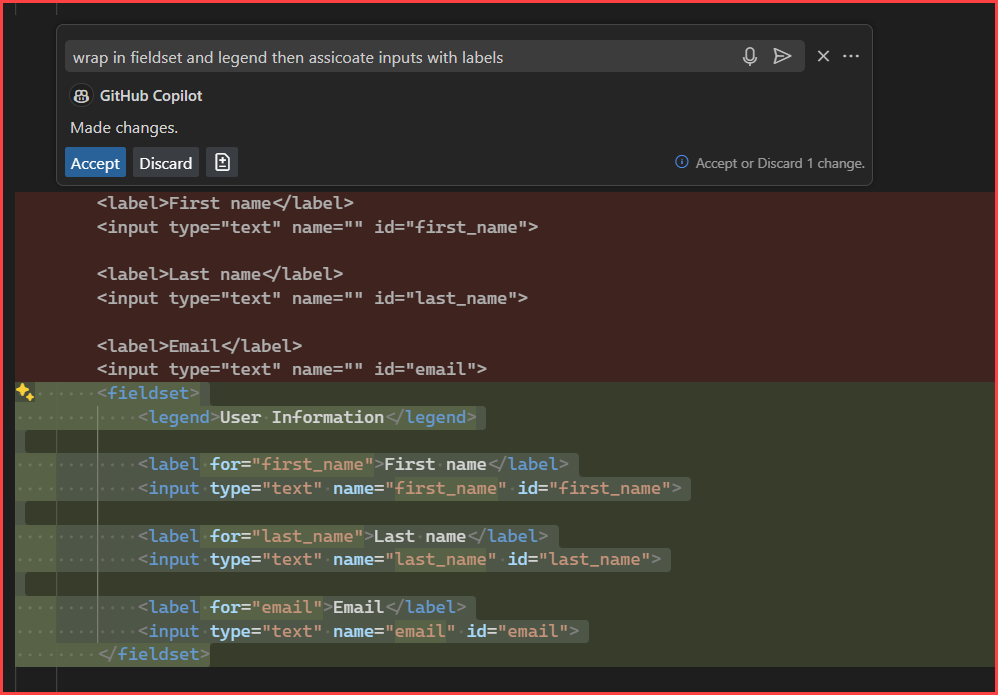
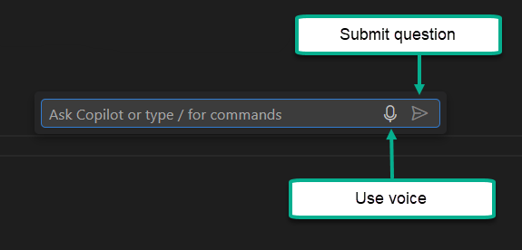
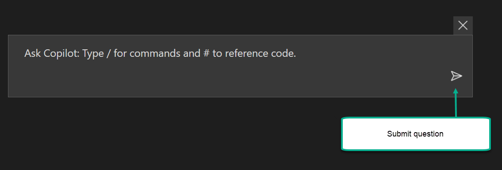

# About

This Visual Studio solution is for demonstrating generative AI using various Visual Studio extensions.

## Security

When asking questions to AI questions:

- Never expose 
    - Customer sensitive information.
    - Company sensitive information.

Always write down the question in a way that it does not expose any sensitive information. 

## Asking questions

Create a text or Word document file, write down your question followed by asking questions in Microsoft Visual Studio or Microsoft Visual Studio Code. 

The reason, if a developer ask a question directly to say GitHub Copilot (or any AI) and click the submit button, the question is gone and AI gets it wrong, the developer needs to rewrite the entire question again with revisions.

### Recommendation

Compose a question in a text or Word document file, then copy and paste the question to Visual Studio or Visual Studio Code. If AI gets it wrong, make a copy of the question, make revisions and retry, repeat until AI gets it right or you give up and go old school.

### Tips

- When working in a csharp project, ask the question in a do nothing class. Once all is correct, move the generated code to the proper class and folders. Having ReSharper will assist in moving the code to the proper folders and updating the namespaces.
- When working with HTML elements and asking a question, consider selecting the element(s) and asking the question. This will help AI to understand the context and provide a better answer.

In the following screenshot, in Microsoft VS Code, the original code is on top.

Question: Wrap the labels and inputs in a fieldset and legend tag followed by connecting labels with inputs.

Asking AI without selecting the elements, in this case GitHub Copilot, will not understand the context and provide a wrong answer.

::

## VS-Code VS2022

Note that VS Code has dictation mode while VS2022 does not.

### VS Code interface

To invoke <kbd>CTRL</kbd> + <kbd>I</kbd>

### Visual Studio interface

To invoke <kbd>ALT</kbd> + <kbd>/</kbd>

